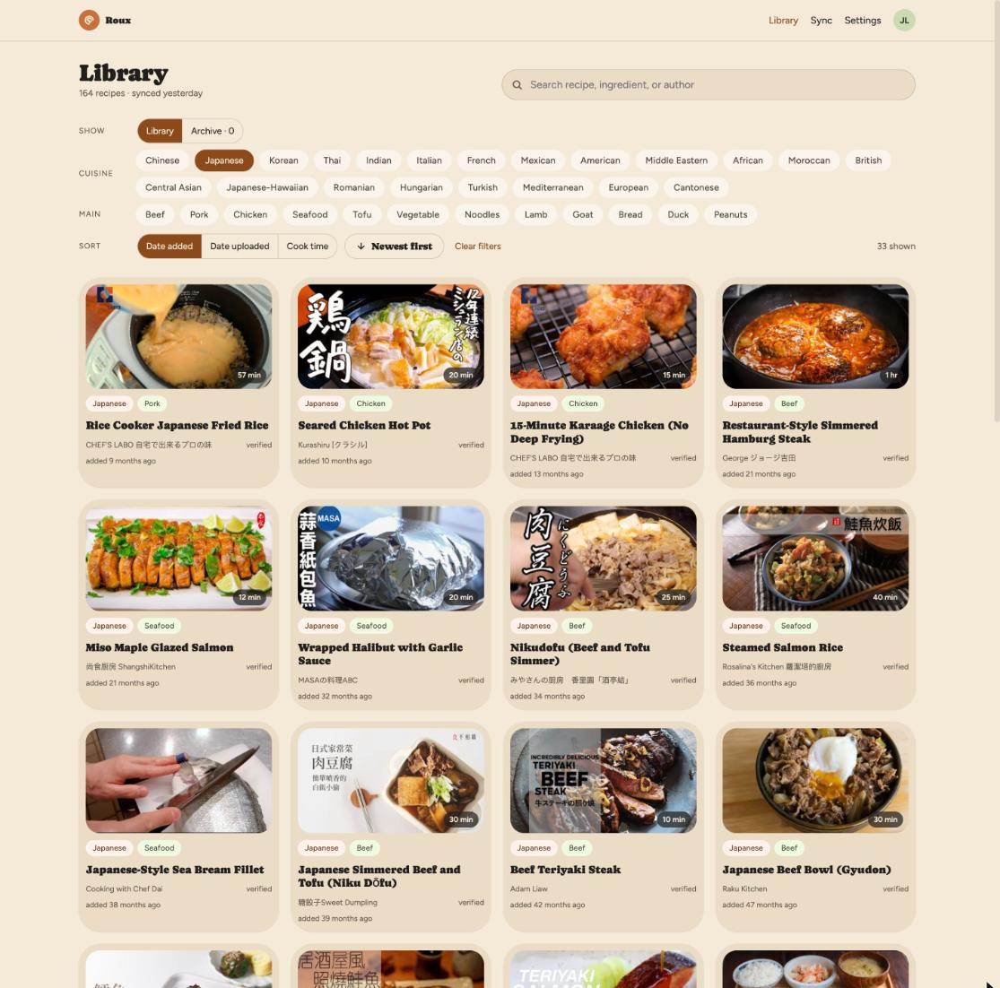
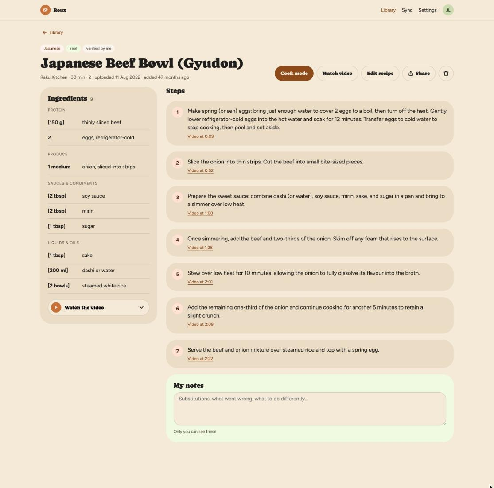
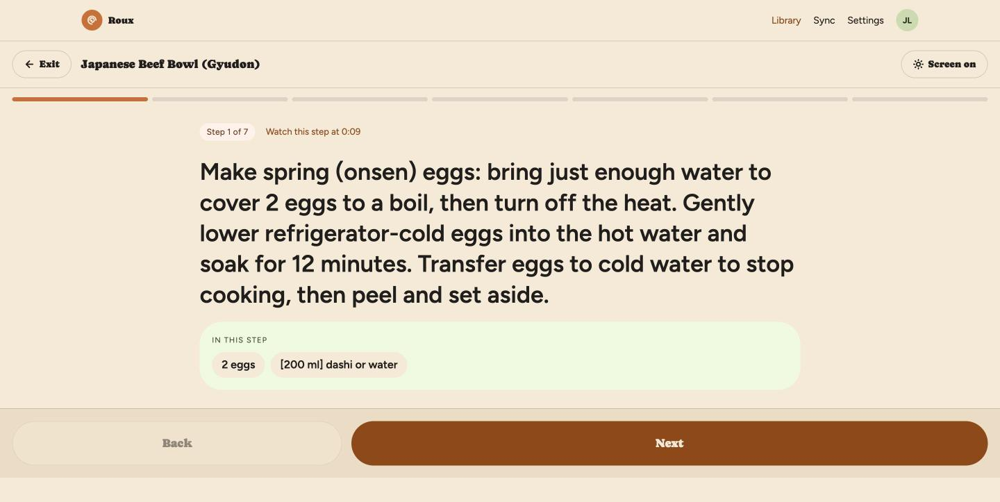

# Roux

Private web app: YouTube cooking playlists → searchable recipe library (ingredients, steps, timestamps).

## Screenshots

**Library** — every recipe from the playlist, filtered by cuisine and main ingredient, searchable by ingredient or author. Here: Japanese, 33 of 164.



**Recipe** — ingredients grouped by role, steps linked to the moment in the video, private notes at the bottom.



**Cook mode** — one step at a time, only the ingredients that step needs, screen kept awake.



## Spec

- Product / API / data: [`prototype/HANDOFF.md`](prototype/HANDOFF.md)
- UI prototype: `prototype/Recipe App.dc.html`
- Implementation plan: [`docs/plans/v1-implementation.md`](docs/plans/v1-implementation.md)

## Stack

Next.js (App Router) · Organic design system · Drizzle + Neon (coming) · Auth.js Google · Claude extract · Vercel Cron

## Setup

```bash
cp .env.example .env.local
npm install
npm run dev
```

Enable the repo's git hooks (blocks accidental direct pushes to `main`,
which auto-deploys to production):

```bash
git config core.hooksPath .githooks
```

Client-side only — GitHub branch protection needs Pro for private repos.
`git push --no-verify` overrides it deliberately.

Open [http://localhost:3000/login](http://localhost:3000/login).

## Scripts

| Command | Purpose |
| --- | --- |
| `npm run dev` | Dev server |
| `npm run build` | Production build |
| `npm test` | Unit tests (`lib/**/*.test.ts`) |

## Status

| Merge | Done |
| --- | --- |
| M0–M1 | Scaffold, Organic, login, types/fixtures/helpers |
| Wave 2 | T1 auth+Drizzle · T3 Claude extract · T6 library · T7 recipe/cook · T8 share/export/settings |
| T4 | YouTube playlists API + Settings picker |
| T5 | Sync pipeline, live recipes API, Sync page, live data adapter |
| Sync | **Local only** — `npm run sync` (YouTube blocks Vercel IPs for captions) |

### Try locally

```bash
npm run dev
```

### Sync playlists → recipes (local)

YouTube returns `LOGIN_REQUIRED` from Vercel/AWS. Run extract on your machine
(home IP); data still lands in Neon for the live site.

```bash
# .env.local needs DATABASE_URL, ANTHROPIC_API_KEY, AUTH_GOOGLE_*, TOKEN_ENCRYPTION_KEY
# Sign in once on the web app first (stores YouTube refresh token).

npm run sync
npm run sync -- --max=10
npm run sync -- --email=you@gmail.com
```

Then refresh https://roux-green.vercel.app — library reads the same DB.

Cloud **Sync now** is disabled on purpose. Purge cron (archived recipes) still runs on Vercel.

### Auth + DB (when ready)

Copy `.env.example` → `.env.local`, set Google OAuth + Neon + `TOKEN_ENCRYPTION_KEY` (`openssl rand -hex 32`).

All tables live in the Postgres **schema** `roux` (not `public`):

```bash
npm run db:init-schema   # CREATE SCHEMA IF NOT EXISTS roux
npm run db:push          # tables → roux.users, roux.recipes, …
# Neon SQL editor: run lib/db/migrations/0001_search.sql (FTS on roux.recipes)
```

If you already pushed into `public` earlier, optionally run `lib/db/migrations/0000_drop_public_if_legacy.sql` then re-push into `roux`.

## License

MIT — see [LICENSE](LICENSE).
